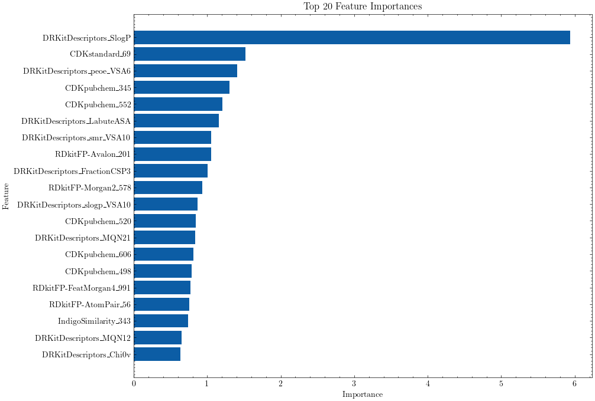
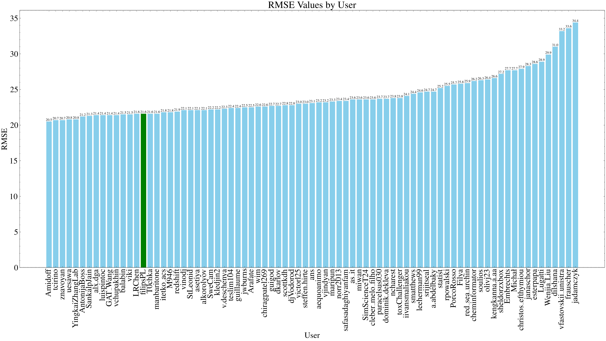

Tox24 Challenge Dataset
===========

This repository contains molecular structures and descriptors for the Tox24 challenge prepared by me (team name: **filipsPL**). The goal of the challenge was to predict the in vitro activity of compounds' activity against [Transthyretin (TTR)](https://en.wikipedia.org/wiki/Transthyretin) using chemical structure data.

- [Tox24 Challenge Dataset](#tox24-challenge-dataset)
  - [Dataset](#dataset)
  - [Descriptors](#descriptors)
  - [Importance of features](#importance-of-features)
  - [The Challenge Results](#the-challenge-results)
  - [References](#references)

## Dataset

This repository includes:

- The chemical structures in SMILES format, provided by the organizers and curated by me using my RDKit pipeline `data/smiles_org+fixed.csv`.
- Training set - a diversified set of 1000 compounds, used for training models `data/train.csv.xz`
- Validation set: a diversified set of 100 compounds, used for final validation of models `data/validation.csv.xz`
- Test set: 500 compounds used to make predictions. It contains a leaderboard set (200 compounds) and a blind set (300 compounds) `data/test.csv.xz`. 💡 This set contains compounds with known and unknown activity. Compounds with known activity are also the members of the Training/Validation set.

## Descriptors

The csv files contain 2D descriptors of molecules, including:

- DRKitDescriptors (2D)
- molecular fingerprints:
  - CDK:
    - CDKECFP4
    - CDKEState
    - CDKFCFP4
    - CDKmolprop
    - CDKpubchem
    - CDKstandard
  - Indigo fingerprints:
    - IndigoResonanceSubstructure
    - IndigoSimilarity
  - RDKit fingerprints:
    - RDkitFP-AtomPair
    - RDkitFP-Avalon
    - RDkitFP-FeatMorgan4
    - RDkitFP-Layered
    - RDkitFP-MACCS
    - RDkitFP-Morgan2
    - RDkitFP-Morgan3
    - RDkitFP-Morgan4
    - RDkitFP-Pattern
    - RDkitFP-RDKit
    - RDkitFP-Torsion

## Importance of features

Feature importances according to the final catboost model

## The Challenge Results

Bar plot showing RMSE of submitted predictions (by me, based on the official results). Congratulations to the winning team Amidoff 🎉!

## References

1. [OCHEM Platform for Tox24](https://ochem.eu/static/challenge.do)
2. [Chem. Res. Toxicol. 2024, 37, 6, 825–826](https://pubs.acs.org/doi/10.1021/acs.chemrestox.4c00192)
